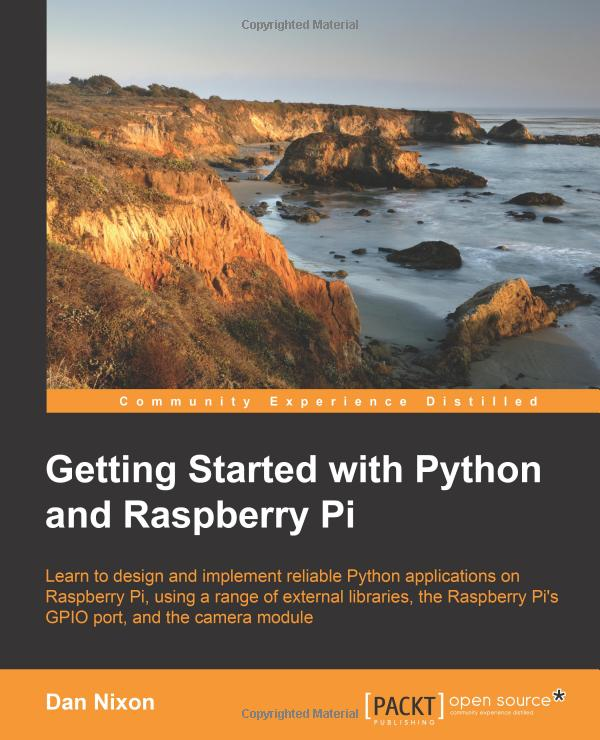

# 110-1 智慧整合感控系統概論 Python (EE5040701)
* 本資源庫統整鍾聖倫教授所開授的「智慧整合感控系統概論」課程資源，內涵課程影片連結、投影片以及範例檔案，同學們可以配合本資源庫學習使用。
* 課程內容中的章節對應此教科書： `Getting Started with Python and Raspberry Pi`，並且有額外加入教材。
* 今年沒有使用 Raspberry Pi，故底下的章節並不是連續的，並且有調整過順序。
* Facebook 社團：https://www.facebook.com/groups/1014739458626072/

## 週次表
| 週  | 日期   |                                                                         | 作業    |
|----|-----:|-------------------------------------------------------------------------|-------|
| 1  | 21   |                                                                         |       |
| 2  | 28   | Chapter 01: Python 環境安裝 (Anaconda + Jupyter Notebook)                   |       |
| 3  | 10/5 | Chapter 02: Understanding Control Flow and Data Types                   |       |
| 4  | 12   | Chapter 03: Working with Data Structures and I/O (1/2)                  |       |
| 5  | 19   | Chapter 03: Working with Data Structures and I/O (2/2)                  | ?資料結構 |
| 6  | 26   | Chapter 04: Object Oriented Programming in Python (Corey Schafer) (1/2) |       |
| 7  | 11/2 | Chapter 04: Object Oriented Programming in Python (Corey Schafer) (2/2) |       |
| 8  | 9    | Chapter 04 (from textbook): Object Oriented Programming in Python (1/2) |       |
| 9  | 16   | Chapter 04 (from textbook): Object Oriented Programming in Python (2/2) |       |
| 10 | 23   | Chapter 05: Packaging Code with setuptools                              | 簡易計算機 |
| 11 | 30   | Chapter 09: Creating Command-line Interfaces (1/2)                      |       |
| 12 | 12/7 | Chapter 09: Creating Command-line Interfaces (2/2)                      |       |
| 13 | 14   | Chapter 08: Extracting Data from the Internet (1/2)                     |       |
| 14 | 21   | Chapter 08: Extracting Data from the Internet (2/2)                     | 網路爬文  |
| 15 | 28   | ?pytorch                                                                |       |
| 16 | 1/4  |                                                                         | 期末專題  |

## 計分方式
1. 3 次作業 20% x 4 = 60%
2. 期末專題 (同儕評分：65 ~ 95 平均分佈) 40%
3. 總評分 C+ ~ A+ 平均分佈；平均為 A-

## 期末報告
1. 兩人一組
2. 必須為原創性的內容
3. 不一定需要使用樹莓派的板子，但最好能與外部連接：相機、感測器、伺服器、上網抓資料等

## 參考
* 教科書
    * Getting Started with Python and Raspberry Pi

* Python 線上課程
    * Python Tutorial by Corey Schafer: 
        * https://www.youtube.com/channel/UCCezIgC97PvUuR4_gbFUs5g
